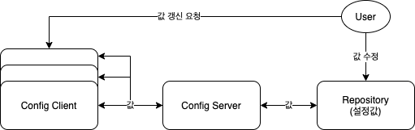
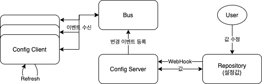

# Spring Cloud Config 톺아보기

## 이 기술은 무엇인가?

- Git repository에 설정값을 보관하고 런타임 중에 값을 바꿀 수 있게 하는 기능이다.  

## 구조는 어떻게 되지?

- Config Server, Config Client가 존재하고 설정값들을 저장하고 관리할 Repository가 필요하다.

### 데이터 흐름

### Config Server 역할

- 설정값을 분리하여 저장시켜 놓은 Repository를 바라보고 읽어온다.
- {label}/{name}-{profiles}.yml GET 요청으로 설정값을 제공한다.
  - [다양하게 URI를 제공하는데, 필요할때 찾아보면서 설정하면 될 것 같다.](https://docs.spring.io/spring-cloud-config/docs/3.0.3/reference/html/#_environment_repository)

### Config Client 역할

- Config Server에게 필요한 설정값을 요청하여 받아와 적용시킨다.

## 어떨 때 쓰일까?

- 운영시 static한 값을 바꿔야 하는 경우 쓸 수 있을 것 같다.
  - 서버가 여러대일 수록 빛을 발할 것 같다.
  - 100대의 서버에 설정값을 바꿔야하는 일이 생긴다면?.. 끔찍하다.. 이런 경우는 도입해야할 듯
- 또 어떤 경우가 있을까?
  - 메인 페이지를 바라보고 있는 경로를 바꿔서 원하는 페이지를 때에 따라 교체해볼 수 있을 것 같다.  
  - 점검 페이지를 띄울 때 경로를 바꿔서 보여줄 수 있을 것 같다.
  - url은 변경되지 않으니 캐싱에 유의해야 할듯

## 단점은 뭐가 있을까?

- 운영상 원격지에서 바꿀 수 있는 백도어와같은 기능이 될수 있을 것 같다.
  - 철저한 관리가 필요해보임
  - 비즈니스 로직을 핸들링하는 것은 적절하지 않음
- config 서버가 죽으면??
  - client는 한번 server에 값을 받으면 로컬캐시에 저장해두고 사용한다.
  - 서버가 응답이 없으면 로컬캐시를 계속 사용함
- public한 저장소말고 private은 안되나?
  - [된다.](https://docs.spring.io/spring-cloud-config/docs/3.0.3/reference/html/#_authentication)
- 데이터는 안전한가?
  - plain text로 저장되어 있어 해킹의 위험이 있음
  - [암호화해서 데이터를 관리할 수 있음](https://docs.spring.io/spring-cloud-config/docs/3.0.3/reference/html/#_encryption_and_decryption)

## 더 알아보기

- Spring cloud bus + MQ 를 사용해서 클라이언트에게 모두 적용할 수 있음
  - 클라이언트가 100개라면 모두 refresh api를 찔러줘야하는데 이것을 해결해줌
  - git repository라면 webhook 기능을 사용해서 config 서버가 bus에 변경이벤트를 등록해서 자동으로 처리가능
    - 단점이라면, 실수로 변경해도 바로 날라가기 때문에 주의해야함
    - 운영환경이라면 이 기능까진 필요없을듯?
- bus + webhook 적용 구조  

